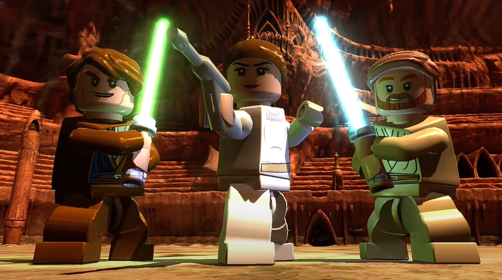

# Documentação "Star Wars: Arena Geonosiana"

## Introdução
"Star Wars: Arena Geonosiana" é um jogo interativo baseado no universo de Star Wars, onde os jogadores assumem o papel de Obi-Wan, Anakin e Padmé enquanto enfrentam desafios na arena Geonosiana. O jogo apresenta uma narrativa interativa com opções de escolha, onde cada decisão impacta o desenrolar da história.

---

## Como Jogar
1. **Iniciar o Jogo:**
   - Clique no botão "Iniciar" para começar a aventura.
   - A introdução será reproduzida automaticamente, mas pode ser pulada clicando no botão "Pular".
   
2. **Exploração e Escolhas:**
   - O jogador interage com a história através de botões de escolha.
   - Cada escolha altera o rumo da narrativa e pode levar a diferentes finais.

3. **Mecânica de Jogo:**
   - Eventos narrativos ocorrem com base nas decisões tomadas.
   - Personagens e inimigos aparecem na tela conforme o progresso.
   - O jogo possui efeitos sonoros e músicas temáticas para maior imersão.

4. **Final do Jogo:**
   - O jogo termina quando o jogador consegue escapar da arena Geonosiana.
   - Após o final, é possível pesquisar informações sobre personagens através de uma integração com a API SWAPI (Star Wars API).

---

## Regras do Jogo
- O jogador deve escolher entre opções apresentadas em cada cena.
- Algumas escolhas levam a situações de risco, enquanto outras garantem vantagens na batalha.
- Não há um sistema de "game over", pois cada escolha altera a história sem um fracasso definitivo.
- As escolhas podem afetar o destino de personagens e o desenvolvimento da história.

---

## Recursos do Jogo
- **Narrativa interativa:** Várias opções de escolha para criar diferentes caminhos.
- **Animação de fundo:** Estrelas em movimento para criar um efeito espacial imersivo.
- **Efeitos sonoros e música:** Trilhas clássicas de Star Wars para ambientação.
- **Busca de personagens:** Possibilidade de pesquisar informações sobre personagens após o jogo através da SWAPI.

---

## Controles
- **Mouse:** Para selecionar opções e interagir com os elementos da interface.
- **Botão "Pular":** Para avançar a introdução rapidamente.
- **Botão "Reiniciar":** Para recomeçar o jogo a qualquer momento.

---

## Tecnologias Utilizadas
- **HTML, CSS e JavaScript:** Para a estrutura, estilos e interatividade do jogo.
- **SWAPI (Star Wars API):** Para buscar informações sobre personagens.
- **SpeechSynthesis API:** Para narração do texto do jogo.
- **Canvas API:** Para animação de estrelas no fundo.

---

## Conclusão
"Star Wars: Arena Geonosiana" é um jogo narrativo que permite aos jogadores reviverem um dos momentos icônicos de Star Wars com escolhas que impactam a história. Com efeitos sonoros, música e interatividade, o jogo oferece uma experiência envolvente para fãs da saga.

